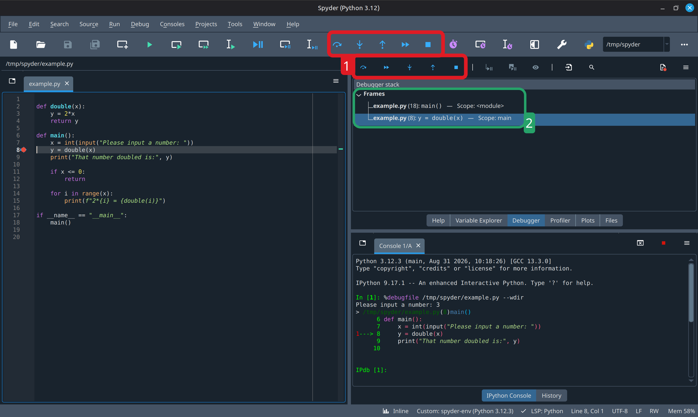
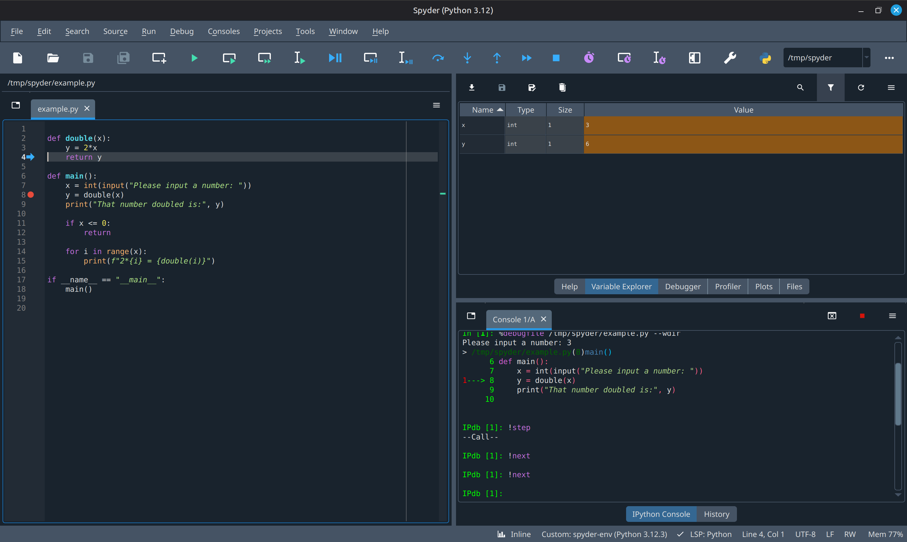
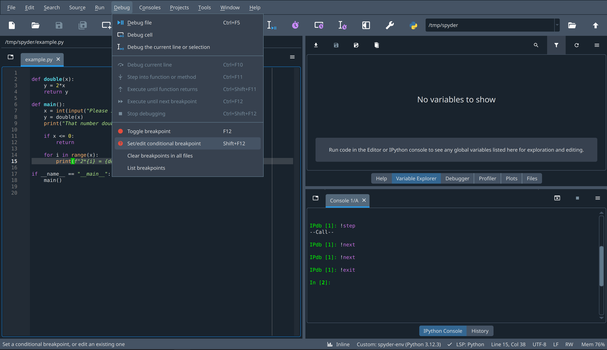
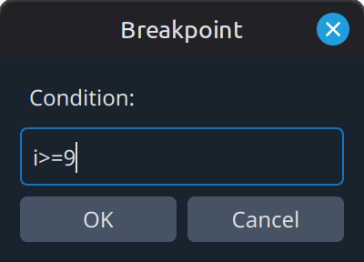
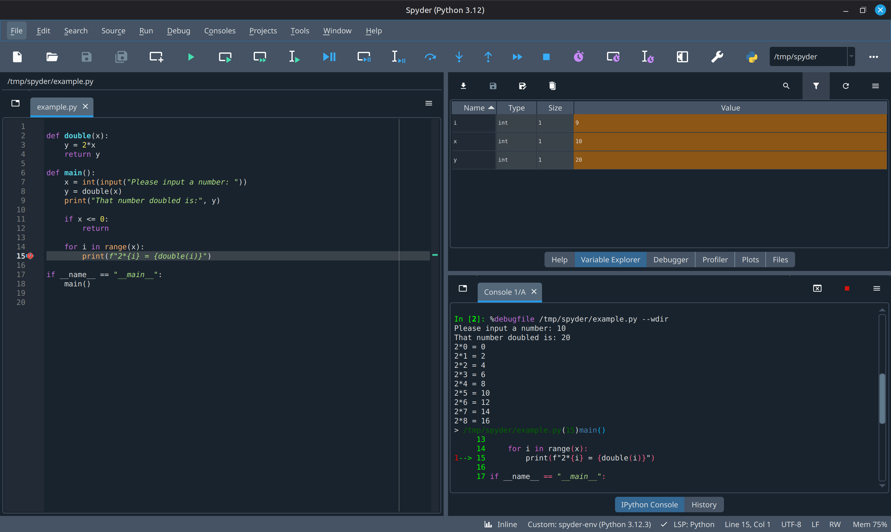

# Jak korzystać z debuggera w Spyderze

**_Do czego służy debbuger?_**

Często pisząc program popełnimy jakiś błąd, który sprawi, że program nie będzie się zachowywać tak, jak oczekiwaliśmy.
Chcąc znaleźć źródło problemu, chciałoby się zatrzymać program w trakcie wykonania i podejrzeć co się znajduje w środku. Do tego właśnie służy debugger.

## Przykładowy program

Przygotowałem krótki program, który poprosi użytkownika o liczbę (całkowitą), po czym ją podwoi i wypisze. Jeśli dodatkowo liczba jest dodatnia, dostaniemy listę podwojeń dla nieujemnych liczb mniejszych od wprowadzonej.

```(python)
def double(x):
    y = 2*x
    return y

def main():
    x = int(input("Please input a number:"))
    y = double(x)
    print("That number doubled is:", y)

    if x <= 0:
        return

    for i in range(x):
        print(f"2*{i} = {double(i)}")

if __name__ == "__main__":
    main()
```

Przykładowe wykonanie

```
Please input a number: 2
That number doubled is: 4
2*0 = 0
2*1 = 2
```

## Korzystanie z debuggera

### Breakpoint i uruchomienie

Korzystając z debuggera należy zacząć od ustawienia breakpointa. Jest to miejsce, w którym chcemy, by debugger zatrzymał wykonanie programu.
Gdy najedziemy myszką nad pustą przestrzeń po prawej stronie numeru linii, pojawi się czerwona kropka. Klikając myszą możemy zaznaczyć breakpoint


Następnie należy uruchomić proces debuggowania wybierając odpowiedni przycisk w menu u góry


W tym programie oczekujemy na input użytkownika, więc najpierw należy podać liczbę. Ja podam 3.

### Sterowanie



Numerem **1** oznaczyłem panel przycisków.
Najeżdżając myszą nad przycisk otrzymamy krótki opis działania przycisku. Oto rozwinięcie sensu tych przycisków:

1. Debug current line - _aka Step over_ - Pozwala aktywnej lini kodu się wykonać, po czym przechodzi do następnej.
2. Step into function or method - _aka Step into_ - Jeśli w aktywnej linii kodu jest jakaś funkcja bądź metoda, debugger wchodzi do niej i następną debuggowaną linią staje się pierwsza linia tej funkcji. W moim przykładzie sprawi to, że debugger przejdzie do 2 linii w pliku.
3. Execute until function returns - _aka Step out_ - pozwala aktualnej funkcji się wykonać i zatrzymuje się dopiero w chwili wyjścia z funkcji. Jest to naturalny odpowiednik poprzedniego przycisku i pozwala wrócić z funkcji do której wstąpiliśmy.
4. Execute until next breakpoint - Wykonuje program normalnie aż do trafienia na kolejny breakpoint. Przydatne gdy mamy kilka breakpointów, bądź jesteśmy w pętli i nie obchodzi nas nic aż do dotarcia do kolejnego breakpointu.
5. Stop debugging - Kończy działanie debuggera

### Stos wywołań

Numerem **2** wyróżniłem okienko _Debugger stack_. W nim znajdziemy tzw. stos wywołań, czyli listę opisującą kolejne zagnieżdżone wywołania funkcji, które nas doprowadziły tam gdzie jesteśmy. Na załączonym obrazku widzimy, że jesteśmy na linii 8 `y = double(x)` w funkcji `main`, która została wywołana w linii 18.
Okienko to będzie szczególnie przydatne gdy będziecie wywoływać dużo funkcji, np. przy programowaniu rekurencyjnym

### Podglądanie zmiennych



Przeszedłem debuggerem do funkcji `double` i przeszedłem do jej końca. Następnie wybrałem okienko _Variable explorer_, gdzie wcześniej był _Debugger Stack_.

_Variable explorer_ pozwala nam podejrzeć zmienne użyte w programie i ich wartości. Jest to bardzo ważne by zrozumieć co się psuje w naszych danych, dlatego osobiście polecam mieć to okienko wybrane przez większość czasu debuggowania.

### Breakpoint warunkowy

Czasem programując piszemy kod, który się psuje jedynie w szczególnych przypadkach, jak np. w ostatnim wykonaniu pętli. Przeklikiwanie 100 razy, by dojść do ostatniej itaracji pętli jest toporne i zniechęci nawet największego amatora debuggera. Tu z pomocą przychodzi breakpoint warunkowy, który pozwala nam powiązać z nim wyrażenie, które gdy prawdziwe, wywoła aktywację breakpointu.

Ustawmy taki breakpoint na linii 15 tak, aby działał on jedynie, gdy i≥9.



Ustawiamy kursor na 15 linii i przechodzimy do menu _Debug_ w górnym pasku, skąd wybieramy opcję Set/edit conditional breakpoint.



Tu wpisujemy oczekiwany warunek zatrzymania programu.

Jeśli teraz odpalimy ponownie debugger a jako `x` podamy 10 debugger zatrzyma się dopiero w tym stanie:


