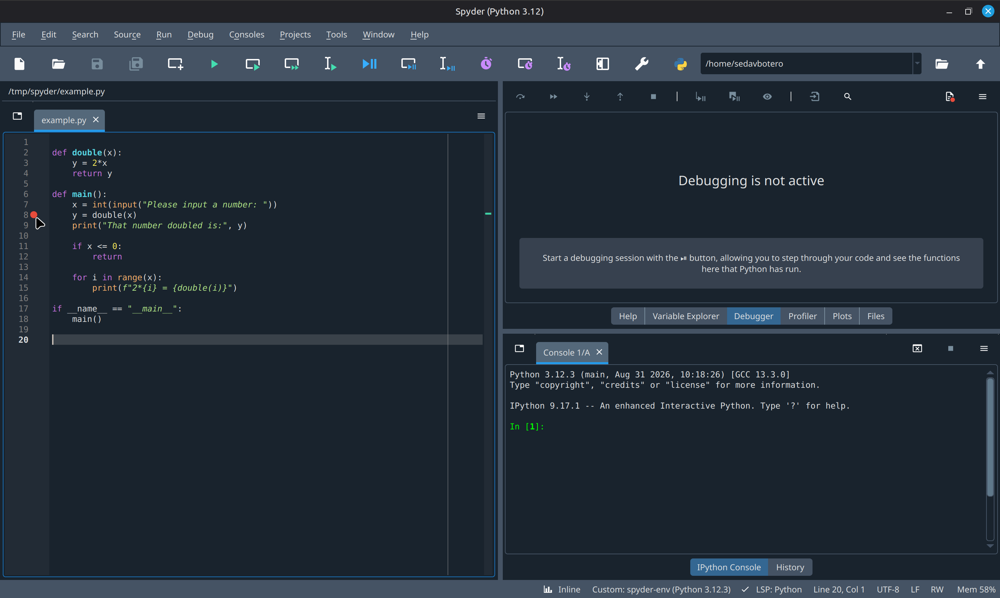
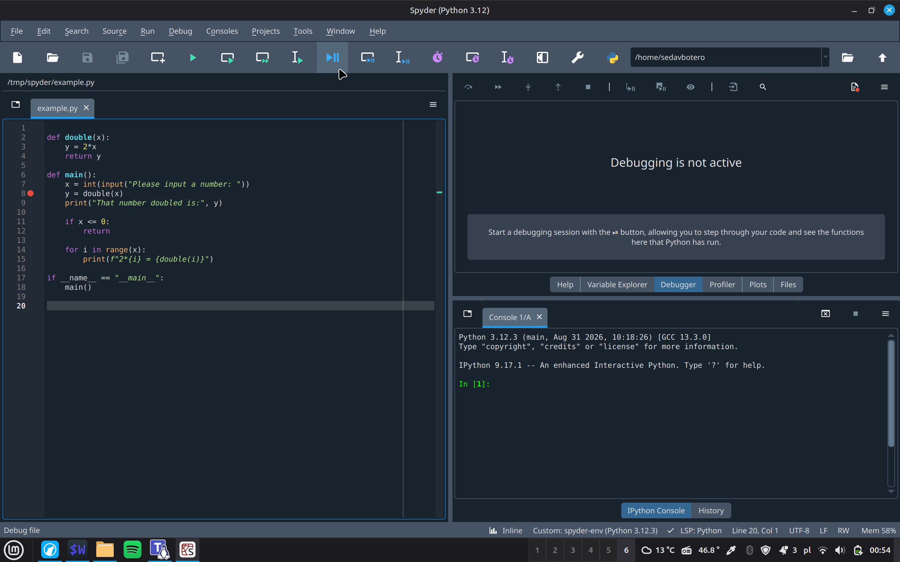

# Jak korzystać z debuggera w Spyderze

**_Do czego służy debbuger?_**

Często pisząc program popełnimy jakiś błąd, który sprawi, że program nie będzie się zachowywać tak, jak oczekiwaliśmy.
Chcąc znaleźć źródło problemu, chciałoby się zatrzymać program w trakcie wykonania i podejrzeć co się znajduje w środku. Do tego właśnie służy debugger.

## Przykładowy program

Przygotowałem krótki program, który poprosi użytkownika o liczbę (całkowitą), po czym ją podwoi i wypisze. Jeśli dodatkowo liczba jest dodatnia, dostaniemy listę podwojeń dla nieujemnych liczb mniejszych od wprowadzonej.

```(python)
def double(x):
    y = 2*x
    return y

def main():
    x = int(input("Please input a number:"))
    y = double(x)
    print("That number doubled is:", y)

    if x <= 0:
        return

    for i in range(x):
        print(f"2*{i} = {double(i)}")

if __name__ == "__main__":
    main()
```

Przykładowe wykonanie

```
Please input a number: 2
That number doubled is: 4
2*0 = 0
2*1 = 2
```

## Korzystanie z debuggera

Korzystając z debuggera należy zacząć od ustawienia breakpointa. Jest to miejsce, w którym chcemy, by debugger zatrzymał wykonanie programu.
Gdy najedziemy myszką nad pustą przestrzeń po prawej stronie numeru linii, pojawi się czerwona kropka. Klikając myszą możemy zaznaczyć breakpoint



Następnie należy uruchomić proces debuggowania wybierając odpowiedni przycisk w menu u góry



W tym programie oczekujemy na input użytkownika, więc najpierw należy podać liczbę. Ja podam 3.
